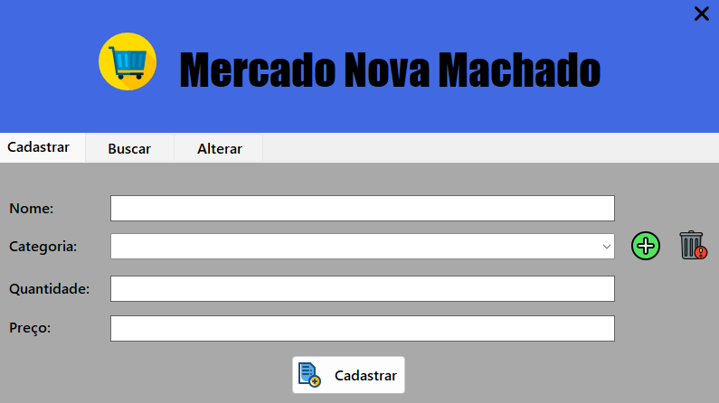
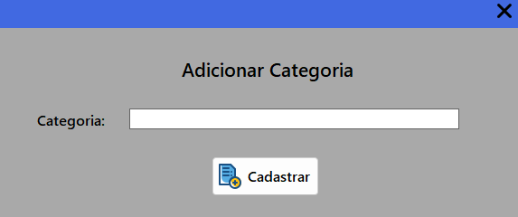
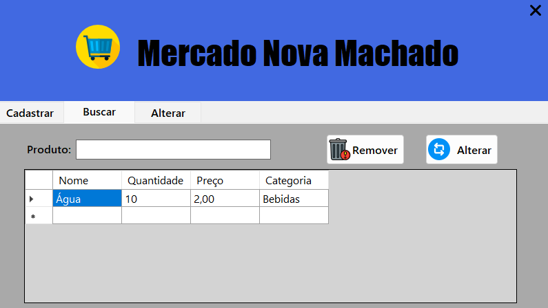
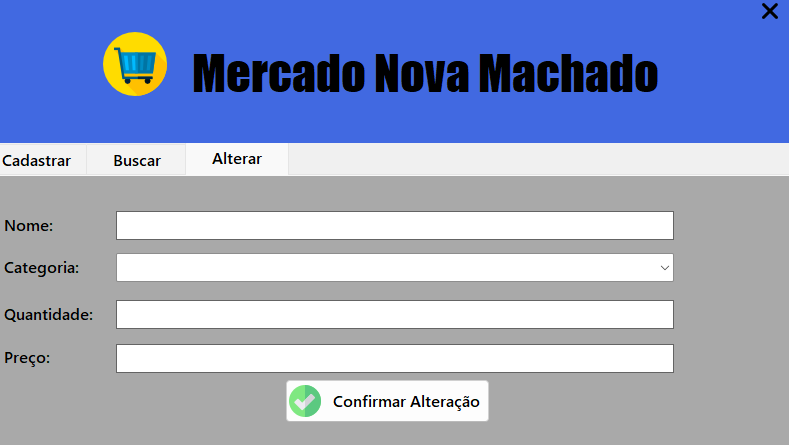

<h1 align="center">Sistema Mercado Nova Machado</h1>

### Linguagens Utilizadas:
* C#
* SQL

### Ferramentas Utilizadas:
* Microsoft Visual Studio
* MySql Workbench
* Xampp

### Funções do Software:
* Inserir dados;
* Listar dados;
* Alterar dados;
* Remover dados;

  ### Tela de Login:

<figure>
  
</figure>

### Tela de Cadastro:

<figure>
  
</figure>

### Tela de Adicionar Categoria:

<figure>
  
</figure>

### Tela de Busca:

<figure>
  
</figure>

### Tela de Alteração:

<figure>
  
</figure>

